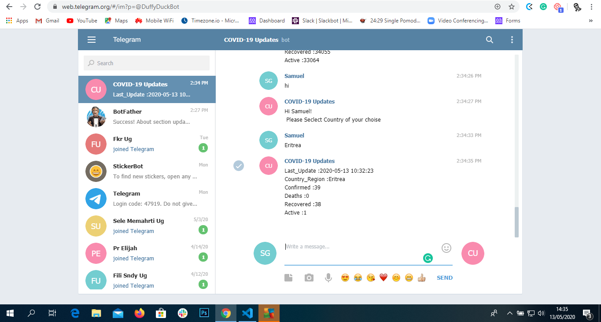

# Telegram_Bot
> A quick and simple Telegram Bot for browsing updated COVID-19 cases globaly by country name.



<br>The aim of the project is to build our own bot using all the best practices we leaned using ruby.<br>
The project specifications can be seen in [Click here](https://www.notion.so/Build-your-own-bot-ebd0d7ac5da240e5987720bdc83f38fa)

## Content

* [Requirements](#requirements)
* [Built With](#built-with)
* [Live Demo](#live-demo)
* [Quick Start](#quick-start)
* [Dependencies](#dependencies)
* [Contributing](#contributing)
* [Acknowledgments](#acknowledgments)
* [Author](#author)
* [License](#license)

## Bot rules.
* You can say Hi
* The next is enter the name of the country of your choise

## Requirements

<ul>
  <h3>Features</h3>
  <li>Type Hi to get the description</li>
  <li>Enter Correct country name</li>
  <li>Displays the latest COVID-19 cases oth the selected country</li>
</ul>

### Built With

- Ruby <br>
- Rubocop (Linter) with Stickler (CI Tool)<br>
- Git (with Gitflow), Github and VScode <br>

## Live Demo

To play online, go to the page and hit (Run) button.
[Run on Repl.it]()

## Quick Start

#### Get a local copy with:<br>
```js
git clone https://github.com/Samitti/Telegram_Bot.git
```
Or just hit (Download Zip) on green button (Clone or Download) on top of this page.

#### Run on terminal/prompt:

If you are on windows:
* Go inside the project folder
* Right shift '+' right mouse click (Float menu)
* Open prompt here (Option)
```js
gem install telegram-bot-ruby
```js
ruby bin/main.rb
```
For linux:
```js
bin/main.rb

### Dependencies

Ruby 2.5.5

### Contributing

Contributions, issues and feature requests are welcome!

You can do it on [issues page](https://github.com/Samitti/Telegram_Bot/issues).

## Acknowledgments

A special thanks for the code reviewers.

## Author

👤 **Samuel**

- Github: (https://github.com/Samitti)
- Linkedin: (https://www.linkedin.com/in/samuel-ghebremeskel-29685811a/)
- Twitter: (https://twitter.com/Samuel63734232)

### License

<strong>Creative Commons</strong>

